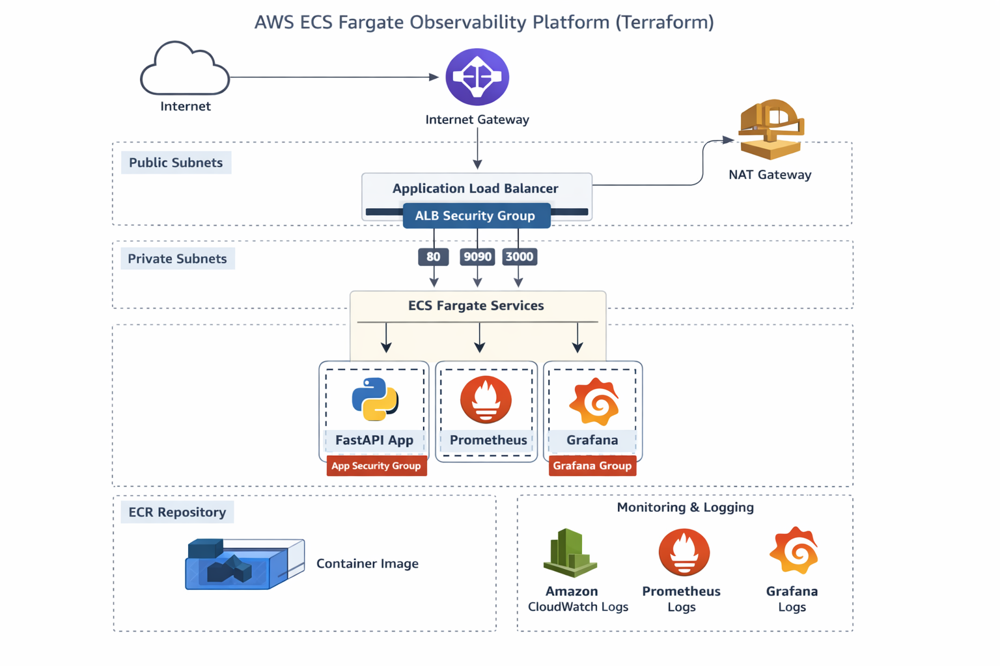

# AWS ECS Fargate – DevOps Observability Project

This project demonstrates how to build a production-grade container platform on AWS using ECS Fargate, Terraform, GitHub Actions, and open-source observability tools.

---

# Architecture Diagram



---

## Core Technologies

- **AWS ECS Fargate** – Serverless container orchestration  
- **Terraform** – Infrastructure as Code  
- **GitHub Actions** – CI/CD pipelines  
- **Prometheus** – Metrics collection  
- **Grafana** – Dashboards and alerting  

---

## Goals

- Provision AWS infrastructure using Terraform  
- Deploy a containerized FastAPI application on ECS Fargate  
- Implement CI/CD using GitHub Actions  
- Collect application metrics with Prometheus  
- Visualize metrics and logs in Grafana  
- Follow real-world DevOps best practices  

---

## High-Level Architecture

- **AWS VPC** with public and private subnets  
- **ECS Fargate services** for application and observability stack  
- **Application Load Balancer** for traffic routing  
- **Prometheus** scraping application metrics  
- **Grafana dashboards** for visualization  

---

## Project Status

🚗 **In Progress**

---

## Development Environment

This project is developed and tested using **AWS Playground**, which provides temporary AWS credentials for hands-on practice.

Due to playground limitations:

- Terraform uses a **local backend** (state stored locally)  
- Managed AWS services (e.g., AMP, AMG) are not used  
- Infrastructure is designed to be **production-ready** but adapted for a sandbox environment  

Production-grade alternatives (remote backend, managed observability) are documented but not enabled.

---

## File Structure

```
.
├── app
│   ├── Dockerfile
│   ├── main.py
│   └── requirements.txt
├── terraform
│   ├── ecr.tf
│   ├── ecs.tf
│   ├── github_actions_iam.tf
│   ├── iam.tf
│   ├── logs.tf
│   ├── main.tf
│   ├── monitoring.tf
│   ├── outputs.tf
│   ├── service.tf
│   ├── task_definition.tf
│   ├── variables.tf
│   └── vpc.tf
├── .github
│   └── workflows
│       └── deploy.yml
├── .gitignore
└── README.md
```

---

## Usage

### 1. Deploy Infrastructure

```bash
cd terraform
terraform init
terraform apply
```

### 2. Build & Push Docker Image

```bash
cd app
docker build -t <your-ecr-repo> .
docker push <your-ecr-repo>
```

### 3. Deploy via GitHub Actions

Push your code to GitHub; the workflow `deploy.yml` will:

- Build the Docker image  
- Push to ECR  
- Update ECS Fargate service  

### 4. Access Application & Observability

- **App URL:** via Application Load Balancer  
- **Prometheus:** http://<alb-dns>:9090  
- **Grafana:** http://<alb-dns>:3000 (default admin password: `admin`)  

---

## Notes

- Metrics from FastAPI are exposed at `/metrics`  
- Grafana dashboards automatically include app metrics  
